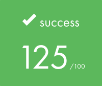

# SnowCrash
Welcome to SnowCrash, a cybersecurity challenge series designed to develop your skills in penetration testing, reverse engineering, and exploit development. In SnowCrash, you'll encounter various security vulnerabilities found in real-world scenarios, ranging from weak password storage mechanisms to web application vulnerabilities and beyond.


```
	   _____                      _____               _
	  / ____|                    / ____|             | |
	 | (___  _ __   _____      _| |     _ __ __ _ ___| |__
	  \___ \| '_ \ / _ \ \ /\ / / |    | '__/ _` / __| '_ \
	  ____) | | | | (_) \ V  V /| |____| | | (_| \__ \ | | |
	 |_____/|_| |_|\___/ \_/\_/  \_____|_|  \__,_|___/_| |_|

```

<p align="center">
   
  
</p>

## Technical Focus

SnowCrash covers a broad spectrum of cybersecurity areas, including:

- **Cryptography**: Decrypting passwords and deciphering substitution ciphers.
- **Network Security**: Analyzing network traffic using packet capture tools like `tshark`.
- **Web Application Security**: Exploiting web server vulnerabilities to execute arbitrary commands.
- **Binary Exploitation**: Reverse engineering and exploiting compiled executables to bypass access controls and execute unauthorized commands.
- **Scripting and Automation**: Crafting scripts in languages like Bash and PHP to automate exploit steps and retrieve flags.
- **Security Tools**: Utilizing penetration testing tools like **John the Ripper** for password cracking and **curl** for web exploitation.

## Exploit Methodologies

Each level in SnowCrash presents a unique challenge requiring you to employ various exploit methodologies, including:

- **Password Cracking**: Using brute-force or dictionary attacks to crack weak passwords.
- **Command Injection**: Injecting malicious commands into vulnerable applications to execute unauthorized actions.
- **Symbolic Link Attacks**: Exploiting symbolic links to bypass file access restrictions.
- **Hexadecimal Manipulation**: Decoding and manipulating hexadecimal data to retrieve sensitive information.

## Challenge Structure

Explore the directories for each level to find detailed READMEs and scripts providing step-by-step instructions on how to exploit the vulnerabilities and retrieve the flags.

## ssh connection
To connect through SSH to a level, run the ssh command with the *level number* and *ip address* as parameters.

### Examples
```bash
ssh level00@localhost -p 4242
```
## Run
To run the script in `levelXX/resources/` that will give you the flag, you have to change the IP address and port in the Dockerfile to be able to connect with ssh inside the running script:
```bash
CMD ["./flag00.sh", "192.168.122.1", "4243"]
```
Then to run the Dockerfile (that will run the flag.sh inside a container) you can do:
```bash
./run.sh
# or
docker build --progress=plain -t flag00-cont . && docker run --network host -it flag00-cont
```

## levelX

<p align="center">
   
</p>

You can hack the entire machine with [CVE-2016-5195](https://github.com/dirtycow/dirtycow.github.io/wiki/VulnerabilityDetails) (Dirty COW). This is a privilege escalation vulnerability in the Linux Kernel that will allows us to create a privileged user that we can use to access to every *flag user* and obtain every flag.

## From root user
```bash
for i in {0..14}; do usr=$(printf "flag%0.2d\n" $i); echo -n "$usr: "; su $usr -c "/bin/getflag"; done
flag00: Check flag.Here is your token : x24ti5gi3x0ol2eh4esiuxias
flag01: Check flag.Here is your token : f2av5il02puano7naaf6adaaf
flag02: Check flag.Here is your token : kooda2puivaav1idi4f57q8iq
flag03: Check flag.Here is your token : qi0maab88jeaj46qoumi7maus
flag04: Check flag.Here is your token : ne2searoevaevoem4ov4ar8ap
flag05: Check flag.Here is your token : viuaaale9huek52boumoomioc
flag06: Check flag.Here is your token : wiok45aaoguiboiki2tuin6ub
flag07: Check flag.Here is your token : fiumuikeil55xe9cu4dood66h
flag08: Check flag.Here is your token : 25749xKZ8L7DkSCwJkT9dyv6f
flag09: Check flag.Here is your token : s5cAJpM8ev6XHw998pRWG728z
flag10: Check flag.Here is your token : feulo4b72j7edeahuete3no7c
flag11: Check flag.Here is your token : fa6v5ateaw21peobuub8ipe6s
flag12: Check flag.Here is your token : g1qKMiRpXf53AWhDaU7FEkczr
flag13: Check flag.Here is your token : 2A31L79asukciNyi8uppkEuSx
flag14: Check flag.Here is your token : 7QiHafiNa3HVozsaXkawuYrTstxbpABHD8CPnHJ
```



